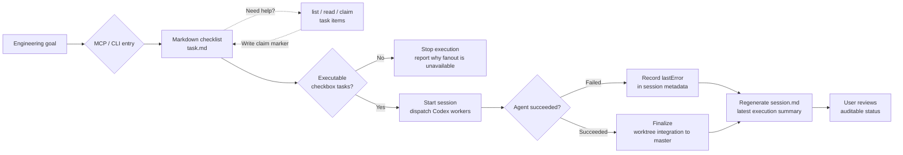

# AgentDesk

[中文说明](docs/README.zh-CN.md)

AgentDesk is an MCP and CLI centered project orchestrator. It turns an engineering goal into a markdown checklist task, lets agents claim work before they start, runs Codex subagents, and records the result as an auditable project session.



AgentDesk is built around three concepts:

- `Project`: any local git repository.
- `Task`: a markdown task file generated for the project.
- `Session`: one execution run that fans out checklist items to Codex subagents and tracks their outcomes.

## Quick Start

AgentDesk requires Node.js 22.12 or newer and a working Codex CLI.

Install the MCP server in Codex without cloning this repository:

```sh
codex mcp add agent-desk -- npx -y --package @pavee/agent-desk agent-desk-mcp
```

This setup is useful across many projects. Pass `projectRoot` when calling MCP tools, and each project gets its own `task/` and `.agent-desk/` state directories.

Bind one MCP server to a fixed project:

```sh
codex mcp add agent-desk-my-project \
  --env AGENT_DESK_PROJECT_ROOT=/absolute/path/to/your/project \
  -- npx -y --package @pavee/agent-desk agent-desk-mcp
```

Install with the helper script:

```sh
curl -fsSL https://raw.githubusercontent.com/Yanzzp999/agent-desk/master/scripts/install-mcp.sh | sh
```

Install for a fixed project:

```sh
curl -fsSL https://raw.githubusercontent.com/Yanzzp999/agent-desk/master/scripts/install-mcp.sh | sh -s -- /absolute/path/to/your/project
```

For local development:

```sh
npm install
codex mcp add agent-desk -- node "$(pwd)/bin/agent-desk-mcp.mjs"
```

For local development with a fixed project:

```sh
codex mcp add agent-desk-my-project \
  --env AGENT_DESK_PROJECT_ROOT=/absolute/path/to/your/project \
  -- node "$(pwd)/bin/agent-desk-mcp.mjs"
```

Verify the setup:

```sh
codex mcp get agent-desk
npm test
```

To expose `verunectl` and `agent-desk-mcp` directly in your shell from a local checkout:

```sh
npm link
```

You can also start the same MCP server through the local CLI:

```sh
./scripts/verunectl.sh mcp --project /absolute/path/to/your/project
```

## Bundled Codex Skills

The package ships optional Codex skill definitions under `skills/`:

- `skills/generate-agentdesk-task/SKILL.md`: turns an explicit user request into an AgentDesk control-plane task. It reviews whether the request is complete enough for an executable `task.md` and asks a follow-up question before task creation when blocking details are missing.
- `skills/run-agentdesk-subagents/SKILL.md`: runs or coordinates an existing AgentDesk task with Codex CLI or Codex App subagents, treating configured parallelism as a maximum concurrency cap.
- `skills/claim-agentdesk-task/SKILL.md`: lets an agent atomically claim one open checklist item from a markdown task, implement only that item, and complete it with the same agent/session identity.

All bundled skills are explicit-invocation only. They keep AgentDesk focused on `task.md`, the MCP/CLI workflow, `gpt-5.5`, `xhigh`, `fast`, batches of up to 6, and the repository-designated working branch.
For this AgentDesk checkout, Codex development work is based on `agentdesk/next`; the user reviews and merges that branch into `master` manually.
Before subagent execution, the coordinating model should review task complexity and concurrent-edit conflict risk, choose and tell the user a recommended per-batch subagent count, and still let the user override the concurrency later within the configured maximum.

## MCP Tools

- `create_task`: creates a markdown task file under `<project>/task/`.
- `list_tasks`: lists markdown task files under `<project>/task/`.
- `read_task`: reads a markdown task file under `<project>/task/`.
- `claim_task_items`: writes visible AgentDesk claim markers onto selected checklist items so multiple agents can coordinate.
- `claim_next_task_item`: atomically claims the first open, unclaimed checklist item and writes the implementing `agent -> sessionId` marker into `task.md`.
- `complete_task_items`: atomically checks off items claimed by the same assignee and session id.
- `create_agentdesk_task`: uses Codex CLI to generate `.agent-desk/tasks/<taskId>/task.md`; if a similar task already exists, it returns clear recovery choices before creating another task. Failed matches are kept for logs, and rebuilding links them to the replacement task.
- `list_agentdesk_tasks` / `read_agentdesk_task`: inspect control-plane tasks, generated `task.md`, and shared `memory.md`.
- `start_subagent_session`: starts or prepares an AgentDesk subagent session.
- `list_subagent_sessions` / `read_subagent_session`: inspect session status, agent summaries, and log indexes.

`start_subagent_session` lets the main agent decide whether worktree isolation is needed. The default `executionMode: "auto"` uses the current checkout for single tasks, serial tasks, or clearly non-overlapping work. AgentDesk creates isolated worktrees only when parallel work lacks conflict evidence or when `worktree` is explicitly requested. The coordinating model should also assess task complexity and conflict risk before choosing how many subagents to launch per batch; after it announces that recommendation, the user can still choose a different concurrency value within the configured maximum.

AgentDesk records the active session on the task before launch. A second session for the same task is rejected while `activeSessionId` is set, unless the caller explicitly uses the duplicate-session override.

Supported launchers:

- `codex-cli`: AgentDesk starts Codex CLI subagents directly, respects the configured `parallelism`, and blocks until the session reaches `succeeded` or `failed` by default. Set `waitForCompletion: false` for a background launch.
- `codex-app`: AgentDesk writes a tracked Codex App launch plan and returns each app subagent prompt with `requiresHostLaunch: true`. The returned subagents stay `prepared_for_app`; the Codex App host launches and waits for them, and AgentDesk does not count host-side execution as AgentDesk-owned subagent success.

## Task Format

`create_task` writes markdown checklist tasks:

```md
# Checkout flow

## Goal

Implement the checkout flow end to end.

## Tasks

- [ ] Add payment state model
- [ ] Wire confirmation screen
```

Claiming a task item writes a visible ownership marker directly below the checkbox:

```md
- [ ] Implement API handler
  - AgentDesk claim: `agent-alpha` at 2026-05-22T10:00:00.000Z; session: `session-abc`; note: implementing
```

Agents should use `claim_next_task_item` before implementation and `complete_task_items` after verification. This keeps the markdown readable for humans while preventing independent agents from silently implementing the same item.

## Defaults

Every session defaults to:

- Model: `gpt-5.5`
- Reasoning effort: `xhigh`
- Service tier: `fast`
- Maximum Codex CLI subagent or Codex App launch-prompt parallelism: `6`
- Execution mode: `auto`
- Launch batch size: `6`
- Generic target-project worktree integration branch: `master`
- AgentDesk repository Codex development baseline: `agentdesk/next`

The model, reasoning effort, execution mode, subagent launcher, and parallelism cap can be changed when a session starts.

## State Layout

Each project stores orchestration state in:

```text
<project>/task/
  <task-slug>.task.md

<project>/.agent-desk/
  tasks/
    <taskId>/
      brief.md
      prompt.md
      task.md
      memory.md
      meta.json
      stdout.log
      stderr.log
  sessions/
    <sessionId>/
      meta.json
      session.md
      stdout.log
      stderr.log
      agents/
        <agentId>/
          task.snapshot.md
          memory.snapshot.md
          prompt.md
          report.json
          stdout.log
          stderr.log
```

`taskId` and `sessionId` stay stable for paths, commands, worktree names, and
MCP lookups. New task and session directory names include a timestamp plus a
readable English slug derived from the task name and brief, so paths are easier
to scan while remaining unique. User-facing lists, details, and structured MCP
results also expose a `name`: task names come from the model-generated `task.md`
H1, and session names reuse that task name so lists stay readable. Execution
settings such as launcher, model, reasoning, service tier, and parallelism remain
available as separate structured fields and in the session document.

Persistent git worktrees are stored outside the project by default:

```text
~/.agent-desk/worktrees/<project-key>/<sessionId>/<agentId>
```

AgentDesk does not automatically delete those worktrees.

## CLI Usage

Create a task:

```sh
./scripts/verunectl.sh tasks create \
  --project /absolute/path/to/project \
  --title "Checkout flow" \
  --brief "Implement the checkout flow end to end"
```

If a similar task already exists, the create command returns candidate tasks instead of immediately generating a new one. Ready matches recommend continuing the existing task. Failed matches recommend creating a replacement while preserving the failed task's logs and linking it to the new task. Use `tasks show <taskId>` to inspect the existing task, `--rebuild` to create the replacement, or `--continue-similar` to return the best match.

AgentDesk keeps the user-facing session default as service tier `fast`. At launch time it asks Codex CLI for the current model catalog and passes the compatible top-level `service_tier` value, so newer CLIs that expose a service tier id such as `priority` do not receive the older `model_provider.service_tier` override.

List and inspect tasks:

```sh
./scripts/verunectl.sh tasks list --project /absolute/path/to/project
./scripts/verunectl.sh tasks show <taskId> --project /absolute/path/to/project
```

Start a Codex subagent session:

```sh
./scripts/verunectl.sh sessions start <taskId> \
  --project /absolute/path/to/project \
  --model gpt-5.5 \
  --reasoning xhigh \
  --parallel 6
```

Available commands:

```text
verunectl tasks list [--json]
verunectl tasks show <taskId> [--json]
verunectl tasks create [--title TEXT] [--brief TEXT] [--rebuild|--continue-similar] [--json]
verunectl mcp [--project DIR]
verunectl config show [--json]
verunectl config init [--force] [--json]
verunectl sessions list [--task <taskId>] [--json]
verunectl sessions show <sessionId> [--json]
verunectl sessions start <taskId> [--model MODEL] [--reasoning EFFORT] [--parallel N] [--execution-mode MODE] [--subagent-launcher LAUNCHER] [--allow-duplicate-session] [--json]
verunectl sessions logs <sessionId> <agentId> [--json]
```

Global options:

- `--project DIR`: choose the project root.
- `--desk-root DIR`: override `<project>/.agent-desk`.
- `--worktrees-root DIR`: override the persistent git worktree root.
- `--codex-cli PATH`: override the Codex CLI executable.

Session options:

- `--model MODEL`: choose the Codex model. Default: `gpt-5.5`.
- `--reasoning EFFORT`: choose `low`, `medium`, `high`, or `xhigh`. Default: `xhigh`.
- `--parallel N`: limit Codex CLI subagent concurrency or Codex App launch prompts. Default: `6`, maximum: `24`.
- `--concurrency N`: alias for `--parallel`.
- `--codex-count N`: alias for `--parallel`.
- `--execution-mode MODE`: choose `auto`, `worktree`, or `current-branch`. Default: `auto`.
- `--subagent-launcher L`: choose `codex-cli` or `codex-app` in `current-branch` mode.
- `--allow-duplicate-session`: override the active-session guard for a task.
- `--force`: alias for `--allow-duplicate-session`.

Fixed workflow defaults:

- Service tier: `fast`.
- Launch batch size: `6`.
- Completed `worktree` sessions rebase onto and fast-forward `master`.

## Runtime Behavior

Task generation:

- Runs through `codex exec`.
- Writes markdown only to `task.md`.
- Produces checkbox subtasks designed for subagent execution.

Session execution:

- Parses subtasks from `task.md`.
- With `codex-cli`, starts one Codex CLI subagent per subtask.
- With `codex-app`, prepares a host launch plan and prompt per subtask without invoking the Codex App host.
- Gives each subagent its own `task.snapshot.md`, `memory.snapshot.md`, and `prompt.md`.
- For AgentDesk-owned Codex CLI launches, starts at most 6 new subagents per batch.
- Respects the configured parallelism cap.
- Uses `auto` mode to avoid worktrees for simple, serial, or clearly non-conflicting work.
- Creates isolated git branches and worktrees in `worktree` mode.
- Commits completed subagent worktree changes before integration.
- Rebases completed subagent branches onto `master` in `worktree` mode.
- Fast-forwards `master` to integrate completed work in `worktree` mode.
- Pushes `master` to its configured upstream after the fast-forward.

`current-branch` mode does not create worktrees. Codex CLI subagents leave unstaged changes in the current checkout for the main agent or caller to review. With `--subagent-launcher codex-app`, AgentDesk writes the session and subagent prompt files, returns an `appLaunchPlan` with `requiresHostLaunch: true`, marks each agent `prepared_for_app`, and leaves `succeededAgents` at `0`; the Codex App host owns the actual launch and wait steps.

Each control-plane task maintains a `memory.md` file for context shared across sessions. AgentDesk injects it into subagent prompts and updates matching memory entries after each agent succeeds or fails.

`session.md` is regenerated as subagents finish, leaving a current execution summary.

## Verification

```sh
npm test
./scripts/verunectl.sh help
codex --version
```

## License

AgentDesk is licensed under the GNU General Public License v3.0 or later (`GPL-3.0-or-later`). See [LICENSE](LICENSE) for details.
