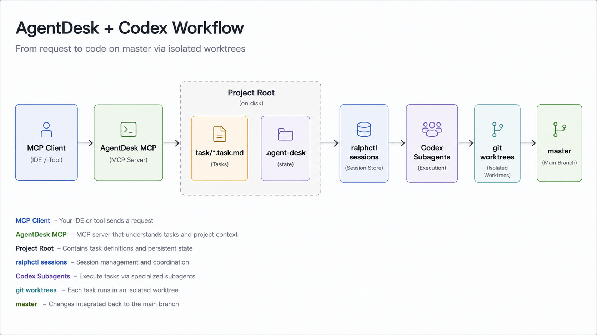

# AgentDesk

AgentDesk 是一个以 MCP 和 CLI 为中心的项目编排工具，用来在任意本地项目里
生成 markdown checklist 任务文件，并通过 Codex CLI 子代理执行这些任务。

它围绕三个概念工作：

- `Project`：任意一个本地 git 仓库
- `Task`：存放在 `<project>/.agent-desk/tasks` 下的 `task.md`
- `Session`：一次执行运行，会把 `task.md` 里的子任务分发给多个 Codex CLI 子代理

AgentDesk 不再提供 GUI、Electron 外壳或本地 Web 应用。当前支持的主要入口是
MCP stdio server 和 `verunectl`。



## MCP 使用方式

AgentDesk 提供 `agent-desk-mcp` stdio server，可以被 Codex、Claude Desktop 或其他
MCP 客户端从任意项目目录启动。默认项目根目录是 MCP server 的启动目录，也可以
通过 `--project` 或 `AGENT_DESK_PROJECT_ROOT` 覆盖。

### 推荐安装到 Codex

不需要 clone 本仓库时，可以直接通过 npm 包注册 MCP server：

```sh
codex mcp add agent-desk -- npx -y --package @pavee/agent-desk agent-desk-mcp
```

这个方式适合多项目使用：调用 MCP tools 时显式传入 `projectRoot`，每个项目都会使用
自己的 `<project>/task/` 和 `<project>/.agent-desk/` 状态目录。

如果希望某个 MCP server 默认绑定到一个固定项目，可以注册时加上环境变量：

```sh
codex mcp add agent-desk-my-project \
  --env AGENT_DESK_PROJECT_ROOT=/absolute/path/to/your/project \
  -- npx -y --package @pavee/agent-desk agent-desk-mcp
```

也可以用一键安装脚本：

```sh
curl -fsSL https://raw.githubusercontent.com/Yanzzp999/agent-desk/master/scripts/install-mcp.sh | sh
```

固定项目：

```sh
curl -fsSL https://raw.githubusercontent.com/Yanzzp999/agent-desk/master/scripts/install-mcp.sh | sh -s -- /absolute/path/to/your/project
```

本地开发时，在本仓库执行一次依赖安装，然后把本地 MCP server 注册到 Codex：

```sh
npm install
codex mcp add agent-desk -- node "$(pwd)/bin/agent-desk-mcp.mjs"
```

本地开发固定项目：

```sh
codex mcp add agent-desk-my-project \
  --env AGENT_DESK_PROJECT_ROOT=/absolute/path/to/your/project \
  -- node "$(pwd)/bin/agent-desk-mcp.mjs"
```

验证安装：

```sh
codex mcp get agent-desk
npm test
```

如果想让本机 shell 也能直接运行 `verunectl` 和 `agent-desk-mcp`，可以在本仓库执行：

```sh
npm link
```

```json
{
  "mcpServers": {
    "agent-desk": {
      "command": "node",
      "args": ["/absolute/path/to/agent-desk/bin/agent-desk-mcp.mjs"],
      "cwd": "/absolute/path/to/your/project"
    }
  }
}
```

也可以通过现有 CLI 启动同一个 MCP server：

```sh
./scripts/verunectl.sh mcp --project /absolute/path/to/your/project
```

MCP tools：

- `create_task`：默认在 `<project>/task/` 下创建 `<title-slug>.task.md`
- `list_tasks`：列出 `<project>/task/` 下的 markdown task 文件
- `read_task`：读取 `<project>/task/` 下的某个 markdown task 文件
- `claim_task_items`：为 checklist item 写入可见的 AgentDesk claim 标记，便于多 agent 协作
- `create_agentdesk_task`：通过 Codex CLI 生成 `.agent-desk/tasks/<taskId>/task.md`；若发现相似 task，默认返回候选项并要求用户确认继续已有 task 还是 `rebuild` 新 task
- `list_agentdesk_tasks` / `read_agentdesk_task`：查看 AgentDesk control-plane task、生成的 `task.md` 和共享 `memory.md`
- `start_subagent_session`：启动或准备 AgentDesk subagent session
- `list_subagent_sessions` / `read_subagent_session`：查看 session 状态、agent 摘要和日志索引

`start_subagent_session` 支持两种 launcher：

- `codex-cli`：由 AgentDesk 直接启动 Codex CLI subagents，遵守 `parallelism` 并发上限；MCP 调用默认阻塞到 session 进入 `succeeded` 或 `failed`，可通过 `waitForCompletion: false` 保留后台启动行为。
- `codex-app`：生成可追踪的 Codex App launch plan，返回每个 app subagent 的 prompt。由于 MCP server 运行在 Node 进程内，不能直接调用 Codex App 宿主的 `spawn_agent` 工具；调用方需要按返回的 `appLaunchPlan.subagents` 并发启动 Codex App subagents。

`create_task` 写出的任务始终使用 markdown 待办清单格式：

```md
# Checkout flow

## Goal

Implement the checkout flow end to end.

## Tasks

- [ ] Add payment state model
- [ ] Wire confirmation screen
```

## 默认配置

每次执行 session 默认使用：

- 模型：`gpt-5.5`
- 思考深度：`xhigh`
- 服务层级：`fast`
- 并发 Codex CLI 子代理数量：`6`
- 启动批次大小：`6`
- 集成分支：`master`

启动 session 时可以配置模型、思考深度和并发 Codex CLI 数量。

## 状态目录

每个项目会把编排状态保存在：

```text
<project>/task/
  <task-slug>.task.md

<project>/.agent-desk/
  tasks/
    <taskId>/
      brief.md
      prompt.md
      task.md
      memory.md
      meta.json
      stdout.log
      stderr.log
  sessions/
    <sessionId>/
      meta.json
      session.md
      stdout.log
      stderr.log
      agents/
        <agentId>/
          task.snapshot.md
          memory.snapshot.md
          prompt.md
          report.json
          stdout.log
          stderr.log
```

持久化 git worktree 默认存放在项目目录之外：

```text
~/.agent-desk/worktrees/<project-key>/<sessionId>/<agentId>
```

AgentDesk 不会自动删除这些 worktree。

## 快速开始

需要 Node.js 22.12 或更新版本，并且本机可以执行 Codex CLI。

```sh
npm install
./scripts/verunectl.sh tasks create \
  --project /absolute/path/to/project \
  --title "Checkout flow" \
  --brief "Implement the checkout flow end to end"
```

如果已有 task 与本次需求相似或一致，创建命令会先返回候选 task，不会直接生成新 task。确认要重新生成时加 `--rebuild`；确认继续已有 task 时用候选 `taskId` 启动 session，或加 `--continue-similar` 让命令返回最佳匹配 task。

任务生成会通过 `codex exec` 执行，并把 markdown 写入：

```text
<project>/.agent-desk/tasks/<taskId>/task.md
```

列出和查看任务：

```sh
./scripts/verunectl.sh tasks list --project /absolute/path/to/project
./scripts/verunectl.sh tasks show <taskId> --project /absolute/path/to/project
```

启动 Codex 子代理 session：

```sh
./scripts/verunectl.sh sessions start <taskId> \
  --project /absolute/path/to/project \
  --model gpt-5.5 \
  --reasoning xhigh \
  --parallel 6
```

## CLI 命令

```text
verunectl tasks list [--json]
verunectl tasks show <taskId> [--json]
verunectl tasks create [--title TEXT] [--brief TEXT] [--rebuild|--continue-similar] [--json]
verunectl mcp [--project DIR]
verunectl sessions list [--task <taskId>] [--json]
verunectl sessions show <sessionId> [--json]
verunectl sessions start <taskId> [--model MODEL] [--reasoning EFFORT] [--parallel N] [--json]
verunectl sessions logs <sessionId> <agentId> [--json]
```

全局参数：

- `--project DIR`：选择项目根目录
- `--desk-root DIR`：覆盖 `<project>/.agent-desk`
- `--worktrees-root DIR`：覆盖持久化 git worktree 根目录
- `--codex-cli PATH`：覆盖 Codex CLI 可执行文件路径

启动 session 的参数：

- `--model MODEL`：选择 Codex 模型，默认 `gpt-5.5`
- `--reasoning EFFORT`：选择 `low`、`medium`、`high` 或 `xhigh`，默认 `xhigh`
- `--parallel N`：限制并发 Codex CLI 子代理数量，默认 `6`，最大 `24`
- `--concurrency N`：`--parallel` 的别名
- `--codex-count N`：`--parallel` 的别名

## 运行行为

任务生成：

- 通过 `codex exec` 运行
- 只把 markdown 写入 `task.md`
- 生成适合子代理执行的 markdown checkbox 子任务

Session 执行：

- 从 `task.md` 解析子任务
- 每个子任务启动一个 Codex CLI 子代理
- 每个子代理使用独立的 `task.snapshot.md`、`memory.snapshot.md` 和 `prompt.md` 作为启动上下文
- 每批最多启动 6 个新的子代理
- 遵守 session 选择的并发 Codex CLI 上限
- 为每个子代理创建独立 git branch 和 git worktree
- 将完成的子代理分支 rebase 到 `master`
- 通过 fast-forward 更新 `master` 集成完成的工作

`current-branch` 模式也可以选择 `--subagent-launcher codex-app`，此时 AgentDesk 会创建 session 和每个 subagent 的 prompt 文件，并等待 Codex App 宿主按 launch plan 直接启动 app subagents。

每个 control-plane task 都会维护一个 `memory.md`，用于记录跨 session 共享的上下文。AgentDesk 会在启动子代理时把该文件注入 prompt，并在每个 agent 完成或失败后用 `sessionId + agentId` 标记自动更新对应 memory 条目。

`session.md` 会随着子代理完成不断重新生成，所以编排器会留下最新执行摘要。

## 验证

```sh
npm test
./scripts/verunectl.sh help
codex --version
```
