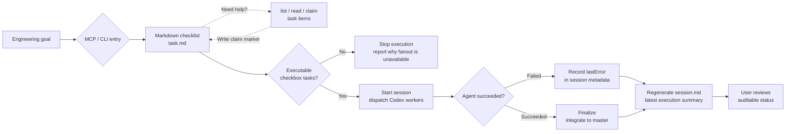

# AgentDesk

[中文说明](docs/README.zh-CN.md)

AgentDesk is an MCP and CLI centered project orchestrator. It turns an engineering goal into a markdown checklist task, lets agents claim work before they start, runs Codex subagents, and records the result as an auditable project session.



AgentDesk is built around three concepts:

- `Project`: any local git repository.
- `Task`: a markdown task file generated for the project.
- `Session`: one execution run that fans out checklist items to Codex subagents and tracks their outcomes.

## Quick Start

AgentDesk requires Node.js 22.12 or newer and a working Codex CLI.

Install the MCP server in Codex without cloning this repository:

```sh
codex mcp add agent-desk -- npx -y --package @pavee/agent-desk agent-desk-mcp
```

This setup is useful across many projects. Pass `projectRoot` when calling MCP tools, and each project gets its own `task/` and `.agent-desk/` state directories.

Bind one MCP server to a fixed project:

```sh
codex mcp add agent-desk-my-project \
  --env AGENT_DESK_PROJECT_ROOT=/absolute/path/to/your/project \
  -- npx -y --package @pavee/agent-desk agent-desk-mcp
```

Install with the helper script:

```sh
curl -fsSL https://raw.githubusercontent.com/Yanzzp999/agent-desk/master/scripts/install-mcp.sh | sh
```

Install for a fixed project:

```sh
curl -fsSL https://raw.githubusercontent.com/Yanzzp999/agent-desk/master/scripts/install-mcp.sh | sh -s -- /absolute/path/to/your/project
```

For local development:

```sh
npm install
codex mcp add agent-desk -- node "$(pwd)/bin/agent-desk-mcp.mjs"
```

For local development with a fixed project:

```sh
codex mcp add agent-desk-my-project \
  --env AGENT_DESK_PROJECT_ROOT=/absolute/path/to/your/project \
  -- node "$(pwd)/bin/agent-desk-mcp.mjs"
```

Verify the setup:

```sh
codex mcp get agent-desk
npm test
```

To expose `verunectl` and `agent-desk-mcp` directly in your shell from a local checkout:

```sh
npm link
```

You can also start the same MCP server through the local CLI:

```sh
./scripts/verunectl.sh mcp --project /absolute/path/to/your/project
```

## MCP Tools

- `create_task`: creates a markdown task file under `<project>/task/`.
- `list_tasks`: lists markdown task files under `<project>/task/`.
- `read_task`: reads a markdown task file under `<project>/task/`.
- `claim_task_items`: writes visible AgentDesk claim markers onto checklist items so multiple agents can coordinate.
- `create_agentdesk_task`: uses Codex CLI to generate `.agent-desk/tasks/<taskId>/task.md`; if a similar task already exists, it returns candidates and asks the caller to continue or rebuild.
- `list_agentdesk_tasks` / `read_agentdesk_task`: inspect control-plane tasks, generated `task.md`, and shared `memory.md`.
- `start_subagent_session`: starts or prepares an AgentDesk subagent session.
- `list_subagent_sessions` / `read_subagent_session`: inspect session status, agent summaries, and log indexes.

`start_subagent_session` lets the main agent decide whether worktree isolation is needed. The default `executionMode: "auto"` uses the current checkout for single tasks, serial tasks, or clearly non-overlapping work. AgentDesk creates isolated worktrees only when parallel work lacks conflict evidence or when `worktree` is explicitly requested.

Supported launchers:

- `codex-cli`: AgentDesk starts Codex CLI subagents directly, respects the configured `parallelism`, and blocks until the session reaches `succeeded` or `failed` by default. Set `waitForCompletion: false` for a background launch.
- `codex-app`: AgentDesk writes a tracked Codex App launch plan and returns each app subagent prompt. The Codex App host launches the subagents and waits for them; AgentDesk records the launch plan without pretending to own the host-side execution.

## Task Format

`create_task` writes markdown checklist tasks:

```md
# Checkout flow

## Goal

Implement the checkout flow end to end.

## Tasks

- [ ] Add payment state model
- [ ] Wire confirmation screen
```

## Defaults

Every session defaults to:

- Model: `gpt-5.5`
- Reasoning effort: `xhigh`
- Service tier: `fast`
- Codex CLI subagent parallelism: `6`
- Execution mode: `auto`
- Launch batch size: `6`
- Integration branch: `master`

The model, reasoning effort, execution mode, and Codex CLI parallelism can be changed when a session starts.

## State Layout

Each project stores orchestration state in:

```text
<project>/task/
  <task-slug>.task.md

<project>/.agent-desk/
  tasks/
    <taskId>/
      brief.md
      prompt.md
      task.md
      memory.md
      meta.json
      stdout.log
      stderr.log
  sessions/
    <sessionId>/
      meta.json
      session.md
      stdout.log
      stderr.log
      agents/
        <agentId>/
          task.snapshot.md
          memory.snapshot.md
          prompt.md
          report.json
          stdout.log
          stderr.log
```

Persistent git worktrees are stored outside the project by default:

```text
~/.agent-desk/worktrees/<project-key>/<sessionId>/<agentId>
```

AgentDesk does not automatically delete those worktrees.

## CLI Usage

Create a task:

```sh
./scripts/verunectl.sh tasks create \
  --project /absolute/path/to/project \
  --title "Checkout flow" \
  --brief "Implement the checkout flow end to end"
```

If a similar task already exists, the create command returns candidate tasks instead of immediately generating a new one. Use `--rebuild` to force a fresh task, start a session with the returned `taskId`, or use `--continue-similar` to continue the best match.

List and inspect tasks:

```sh
./scripts/verunectl.sh tasks list --project /absolute/path/to/project
./scripts/verunectl.sh tasks show <taskId> --project /absolute/path/to/project
```

Start a Codex subagent session:

```sh
./scripts/verunectl.sh sessions start <taskId> \
  --project /absolute/path/to/project \
  --model gpt-5.5 \
  --reasoning xhigh \
  --parallel 6
```

Available commands:

```text
verunectl tasks list [--json]
verunectl tasks show <taskId> [--json]
verunectl tasks create [--title TEXT] [--brief TEXT] [--rebuild|--continue-similar] [--json]
verunectl mcp [--project DIR]
verunectl sessions list [--task <taskId>] [--json]
verunectl sessions show <sessionId> [--json]
verunectl sessions start <taskId> [--model MODEL] [--reasoning EFFORT] [--parallel N] [--execution-mode MODE] [--json]
verunectl sessions logs <sessionId> <agentId> [--json]
```

Global options:

- `--project DIR`: choose the project root.
- `--desk-root DIR`: override `<project>/.agent-desk`.
- `--worktrees-root DIR`: override the persistent git worktree root.
- `--codex-cli PATH`: override the Codex CLI executable.

Session options:

- `--model MODEL`: choose the Codex model. Default: `gpt-5.5`.
- `--reasoning EFFORT`: choose `low`, `medium`, `high`, or `xhigh`. Default: `xhigh`.
- `--parallel N`: limit Codex CLI subagent concurrency. Default: `6`, maximum: `24`.
- `--concurrency N`: alias for `--parallel`.
- `--codex-count N`: alias for `--parallel`.
- `--execution-mode MODE`: choose `auto`, `worktree`, or `current-branch`. Default: `auto`.
- `--subagent-launcher L`: choose `codex-cli` or `codex-app` in `current-branch` mode.

## Runtime Behavior

Task generation:

- Runs through `codex exec`.
- Writes markdown only to `task.md`.
- Produces checkbox subtasks designed for subagent execution.

Session execution:

- Parses subtasks from `task.md`.
- Starts one Codex CLI subagent per subtask.
- Gives each subagent its own `task.snapshot.md`, `memory.snapshot.md`, and `prompt.md`.
- Launches at most 6 new subagents per batch.
- Respects the configured Codex CLI concurrency limit.
- Uses `auto` mode to avoid worktrees for simple, serial, or clearly non-conflicting work.
- Creates isolated git branches and worktrees in `worktree` mode.
- Rebases completed subagent branches onto `master` in `worktree` mode.
- Fast-forwards `master` to integrate completed work in `worktree` mode.

`current-branch` mode does not create worktrees. Codex CLI subagents leave unstaged changes in the current checkout for the main agent or caller to review. With `--subagent-launcher codex-app`, AgentDesk writes the session and subagent prompt files, ends the launch-plan preparation as `succeeded`, and lets the Codex App host launch and wait for app subagents.

Each control-plane task maintains a `memory.md` file for context shared across sessions. AgentDesk injects it into subagent prompts and updates matching memory entries after each agent succeeds or fails.

`session.md` is regenerated as subagents finish, leaving a current execution summary.

## Verification

```sh
npm test
./scripts/verunectl.sh help
codex --version
```
