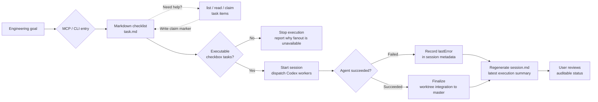

# AgentDesk

[中文说明](docs/README.zh-CN.md)

AgentDesk is a local MCP and CLI orchestrator for Codex work. It turns an engineering goal into a markdown checklist task, lets agents claim work before they start, runs Codex subagents, and records the result as an auditable project session.



## What It Is

AgentDesk is built around three objects:

- `Project`: any local git repository.
- `Task`: a generated `task.md` with checkbox subtasks.
- `Session`: one execution run that fans out task items to Codex CLI workers or prepares a Codex App launch plan.

Agents can use `claim_next_task_item` before implementation; the visible marker records `agent -> sessionId` so people and other agents can see ownership. Before subagent execution, the coordinating model should review task complexity and concurrent-edit conflict risk, choose a recommended per-batch subagent count, and tell the user; the user can still choose a different concurrency value within the configured maximum.

AgentDesk currently has no GUI, Electron app, or web runtime. The supported interfaces are MCP stdio and `verunectl`.

## Local MCP Setup

AgentDesk currently runs from a local checkout. It requires Node.js 22.12 or newer and a working Codex CLI.

```sh
npm install
codex mcp add agent-desk -- node "$(pwd)/bin/agent-desk-mcp.mjs"
codex mcp get agent-desk
```

To bind the MCP server to a fixed project:

```sh
codex mcp add agent-desk-my-project \
  --env AGENT_DESK_PROJECT_ROOT=/absolute/path/to/your/project \
  -- node "$(pwd)/bin/agent-desk-mcp.mjs"
```

You can also start the same MCP server through the local CLI:

```sh
./scripts/verunectl.sh mcp --project /absolute/path/to/your/project
```

## Common CLI

Create a task:

```sh
./scripts/verunectl.sh tasks create \
  --project /absolute/path/to/project \
  --title "Checkout flow" \
  --brief "Implement the checkout flow end to end"
```

List and inspect tasks:

```sh
./scripts/verunectl.sh tasks list --project /absolute/path/to/project
./scripts/verunectl.sh tasks show <taskId> --project /absolute/path/to/project
```

Start a session:

```sh
./scripts/verunectl.sh sessions start <taskId> \
  --project /absolute/path/to/project \
  --model gpt-5.5 \
  --reasoning xhigh \
  --parallel 6
```

Useful session commands:

```sh
./scripts/verunectl.sh sessions list --project /absolute/path/to/project
./scripts/verunectl.sh sessions show <sessionId> --project /absolute/path/to/project
./scripts/verunectl.sh sessions logs <sessionId> <agentId> --project /absolute/path/to/project
```

Defaults: model `gpt-5.5`, reasoning `xhigh`, service tier `fast`, execution mode `auto`, launch batch size `6`, and maximum parallelism `6`.

## State Layout

Each project stores AgentDesk state inside the project, while persistent worktrees live under the user home directory.

```text
<project>/task/
  <task-slug>.task.md

<project>/.agent-desk/
  tasks/
    <taskId>/
      brief.md
      prompt.md
      task.md
      memory.md
      meta.json
      stdout.log
      stderr.log
  sessions/
    <sessionId>/
      meta.json
      session.md
      stdout.log
      stderr.log
      agents/
        <agentId>/
          task.snapshot.md
          memory.snapshot.md
          prompt.md
          report.json
          stdout.log
          stderr.log

~/.agent-desk/worktrees/<project-key>/<sessionId>/<agentId>
```

`taskId` and `sessionId` are stable references for paths, commands, worktrees, and MCP lookups. `memory.md` preserves shared task context across sessions, and `session.md` is regenerated as agents finish.

Detailed skills, MCP tools, task format, and verification notes are in [docs/reference.md](docs/reference.md). Runtime behavior details are in [docs/design.md](docs/design.md).

## License

AgentDesk is licensed under the GNU General Public License v3.0 or later (`GPL-3.0-or-later`). See [LICENSE](LICENSE) for details.
