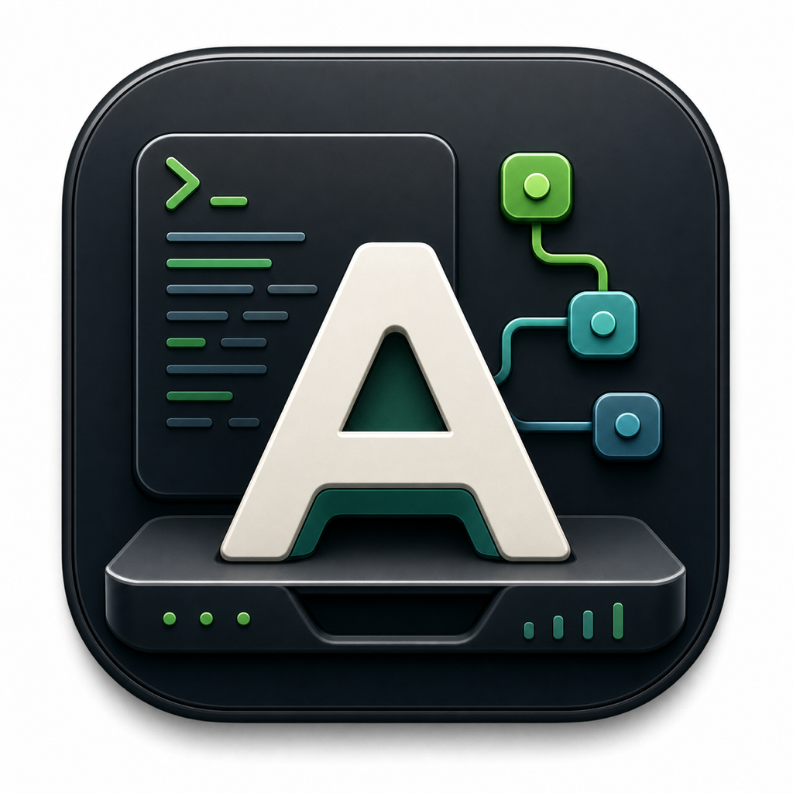

# AgentDesk



AgentDesk is a standalone project orchestrator for Codex-driven task generation
and multi-subagent execution.

It is built around three concepts:

- `Project`: any local directory you want to manage
- `Task`: a generated `task.md` document stored in `<project>/.agent-desk/tasks`
- `Session`: one execution run that fans a task out to multiple Codex subagents

## What Changed

This version no longer uses `prd.json`, and it no longer includes Gemini CLI
or Claude Code compatibility layers.

AgentDesk now works like this:

- select a project directory
- generate a `task.md` file from a feature brief using Codex
- choose a task and start a session with a configurable parallel agent count
- let AgentDesk launch subagents in batches of 6
- keep one persistent git worktree per subagent
- integrate completed subagent branches into `master`
- update session documentation after subagents finish

Every execution subagent is pinned to:

- model: `gpt-5.5`
- reasoning: `xhigh`
- service tier: `fast`

## State Layout

Each project stores orchestration state in:

```text
<project>/.agent-desk/
  tasks/
    <taskId>/
      brief.md
      prompt.md
      task.md
      meta.json
      stdout.log
      stderr.log
  sessions/
    <sessionId>/
      meta.json
      session.md
      stdout.log
      stderr.log
      agents/
        <agentId>/
          prompt.md
          report.json
          stdout.log
          stderr.log
```

Persistent git worktrees are stored outside the project by default under:

```text
~/.agent-desk/worktrees/<project-key>/<sessionId>/<agentId>
```

AgentDesk never auto-deletes those worktrees.

## Quick Start

Requires Node.js 22.12 or newer.

```sh
npm install
npm run dev
```

You can also run the local server or CLI directly:

```sh
./scripts/ralphctl.sh gui
./scripts/ralphctl.sh serve --project /absolute/path/to/project
./scripts/ralphctl.sh tasks list --project /absolute/path/to/project
```

## CLI

```text
ralphctl dev
ralphctl gui
ralphctl gui open
ralphctl serve
ralphctl tasks list
ralphctl tasks show <taskId>
ralphctl tasks create --title "Checkout flow" --brief "..."
ralphctl sessions list
ralphctl sessions show <sessionId>
ralphctl sessions start <taskId> --parallel 8
ralphctl sessions logs <sessionId> <agentId>
```

Global options:

- `--project DIR` selects the project root
- `--desk-root DIR` overrides `<project>/.agent-desk`
- `--worktrees-root DIR` overrides the persistent worktree root

## Runtime Behavior

Task generation:

- runs through `codex exec`
- writes markdown only to `task.md`
- is intended to produce subagent-ready checkbox subtasks

Session execution:

- parses subtasks from `task.md`
- starts one Codex subagent per subtask
- launches new subagents in batches of 6
- respects the session's selected parallelism cap
- assigns each subagent its own git branch and git worktree
- rebases finished subagent branches onto `master`
- fast-forwards `master` to integrate completed work

The session documentation file `session.md` is regenerated after subagents
finish so the main orchestrator always leaves behind a current summary.

## API

Core endpoints:

```text
GET  /api/health
GET  /api/projects
POST /api/projects/select
GET  /api/tasks
POST /api/tasks
GET  /api/tasks/:taskId
GET  /api/tasks/:taskId/sessions
POST /api/tasks/:taskId/sessions
GET  /api/sessions
GET  /api/sessions/:sessionId
GET  /api/sessions/:sessionId/agents/:agentId/logs
GET  /api/events
```

## Verification

```sh
npm test
```
