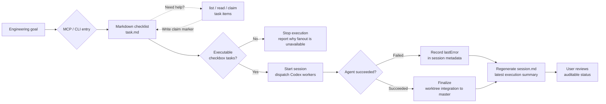

# AgentDesk

AgentDesk 是一个以 MCP 和 CLI 为中心的项目编排工具，用来在任意本地项目里
生成 markdown checklist 任务文件，通过 Codex CLI 子代理执行任务，或为 Codex App
准备可追踪的 launch plan。

它围绕三个概念工作：

- `Project`：任意一个本地 git 仓库
- `Task`：存放在 `<project>/.agent-desk/tasks` 下的 `task.md`
- `Session`：一次执行运行，会把 `task.md` 里的子任务交给 Codex CLI 子代理，或生成 Codex App host 可执行的 launch plan

AgentDesk 不再提供 GUI、Electron 外壳或本地 Web 应用。当前支持的主要入口是
MCP stdio server 和 `verunectl`。

[English README](../README.md)



## MCP 使用方式

AgentDesk 提供 `agent-desk-mcp` stdio server，可以被 Codex 或其他 MCP 客户端从任意项目目录启动。默认项目根目录是 MCP server 的启动目录，也可以
通过 `--project` 或 `AGENT_DESK_PROJECT_ROOT` 覆盖。

### 推荐安装到 Codex

不需要 clone 本仓库时，可以直接通过 npm 包注册 MCP server：

```sh
codex mcp add agent-desk -- npx -y --package @pavee/agent-desk agent-desk-mcp
```

这个方式适合多项目使用：调用 MCP tools 时显式传入 `projectRoot`，每个项目都会使用
自己的 `<project>/task/` 和 `<project>/.agent-desk/` 状态目录。

如果希望某个 MCP server 默认绑定到一个固定项目，可以注册时加上环境变量：

```sh
codex mcp add agent-desk-my-project \
  --env AGENT_DESK_PROJECT_ROOT=/absolute/path/to/your/project \
  -- npx -y --package @pavee/agent-desk agent-desk-mcp
```

也可以用一键安装脚本：

```sh
curl -fsSL https://raw.githubusercontent.com/Yanzzp999/agent-desk/master/scripts/install-mcp.sh | sh
```

固定项目：

```sh
curl -fsSL https://raw.githubusercontent.com/Yanzzp999/agent-desk/master/scripts/install-mcp.sh | sh -s -- /absolute/path/to/your/project
```

本地开发时，在本仓库执行一次依赖安装，然后把本地 MCP server 注册到 Codex：

```sh
npm install
codex mcp add agent-desk -- node "$(pwd)/bin/agent-desk-mcp.mjs"
```

本地开发固定项目：

```sh
codex mcp add agent-desk-my-project \
  --env AGENT_DESK_PROJECT_ROOT=/absolute/path/to/your/project \
  -- node "$(pwd)/bin/agent-desk-mcp.mjs"
```

验证安装：

```sh
codex mcp get agent-desk
npm test
```

如果想让本机 shell 也能直接运行 `verunectl` 和 `agent-desk-mcp`，可以在本仓库执行：

```sh
npm link
```

```json
{
  "mcpServers": {
    "agent-desk": {
      "command": "node",
      "args": ["/absolute/path/to/agent-desk/bin/agent-desk-mcp.mjs"],
      "cwd": "/absolute/path/to/your/project"
    }
  }
}
```

也可以通过现有 CLI 启动同一个 MCP server：

```sh
./scripts/verunectl.sh mcp --project /absolute/path/to/your/project
```

## 内置 Codex Skills

这个包会随 npm 发布四个可选 Codex skill 定义，位于 `skills/`：

- `skills/generate-agentdesk-task/SKILL.md`：把显式用户需求转成 AgentDesk control-plane task。它会先审查需求是否足以生成可执行的 `task.md`；如果目标、范围、验收或关键约束等阻塞信息缺失，会先反问用户补充，再创建 task。
- `skills/review-agentdesk-task/SKILL.md`：对某个 AgentDesk task 或 `task.md` 做实现前只读审查，找出歧义、缺失验收、范围偏差，以及后续 agent 可能偏离用户意图的地方。
- `skills/run-agentdesk-subagents/SKILL.md`：基于已有 AgentDesk task 启动或协调 Codex CLI / Codex App 子代理，并把配置的 parallelism 视为最大并发上限。
- `skills/claim-agentdesk-task/SKILL.md`：让 agent 从 markdown task 中原子领取一个未完成 checklist item，只实现这一项，并用同一个 agent/session 身份完成它。

所有内置 skill 都只在显式点名时使用。它们会让 AgentDesk 保持聚焦在 `task.md`、MCP/CLI 工作流、`gpt-5.5`、`xhigh`、`fast`、每批最多 6 个子代理，以及仓库指定的工作分支。
在这个 AgentDesk checkout 中，Codex 开发工作基于 `agentdesk/next`；用户会手动审查并把它合并到 `master`。
在执行子代理前，协调模型应先评审 task 复杂度和并发编辑冲突风险，决定并告知用户推荐的每批 subagent 数量；之后用户仍可在配置上限内自行选择不同的并发量。

MCP tools：

- `create_task`：默认在 `<project>/task/` 下创建 `<title-slug>.task.md`
- `list_tasks`：列出 `<project>/task/` 下的 markdown task 文件
- `read_task`：读取 `<project>/task/` 下的某个 markdown task 文件
- `claim_task_items`：为指定 checklist item 写入可见的 AgentDesk claim 标记，便于多 agent 协作
- `claim_next_task_item`：原子领取第一个未完成且未被领取的 checklist item，并把正在实现的 `agent -> sessionId` 写进 `task.md`
- `complete_task_items`：原子勾选同一个 assignee 和 session id 已领取的 item
- `create_agentdesk_task`：通过 Codex CLI 生成 `.agent-desk/tasks/<taskId>/task.md`；若发现相似 task，默认先返回清晰的恢复选项。失败的相似 task 会保留日志，并在 `rebuild` 后关联到 replacement task
- `list_agentdesk_tasks` / `read_agentdesk_task`：查看 AgentDesk control-plane task、生成的 `task.md` 和共享 `memory.md`
- `start_subagent_session`：启动或准备 AgentDesk subagent session
- `list_subagent_sessions` / `read_subagent_session`：查看 session 状态、agent 摘要和日志索引

`start_subagent_session` 由主 agent 先判断是否需要 worktree 隔离。默认
`executionMode: "auto"`：单个子任务、串行执行，或子任务明确落在互不重叠的文件/模块时，
AgentDesk 会使用当前 checkout；只有并发任务缺少无冲突证据、或显式选择 `worktree` 时，
才会创建独立 worktree。协调模型也应先评审 task 复杂度与并发冲突风险，再决定每批启动多少
subagent；模型会把这个推荐通知用户，用户后续仍可在配置上限内自行指定并发量。

AgentDesk 会在启动前把 active session 记录到 task meta。只要 `activeSessionId` 仍存在，同一个 task 的第二个 session 会被拒绝，除非调用方显式使用重复 session 覆盖参数。

`start_subagent_session` 支持两种 launcher：

- `codex-cli`：由 AgentDesk 直接启动 Codex CLI subagents，遵守 `parallelism` 并发上限；MCP 调用默认阻塞到 session 进入 `succeeded` 或 `failed`，可通过 `waitForCompletion: false` 保留后台启动行为。
- `codex-app`：生成可追踪的 Codex App launch plan，返回每个 app subagent 的 prompt，并在 MCP 结果中返回 `requiresHostLaunch: true`。这些 subagent 状态保持为 `prepared_for_app`，`succeededAgents` 保持为 `0`；由于 MCP server 运行在 Node 进程内，不能直接调用 Codex App 宿主的 `spawn_agent` 工具，后续启动与等待由 Codex App 宿主负责。

`create_task` 写出的任务始终使用 markdown 待办清单格式：

```md
# Checkout flow

## Goal

Implement the checkout flow end to end.

## Tasks

- [ ] Add payment state model
- [ ] Wire confirmation screen
```

领取某个 item 时，AgentDesk 会把可见归属标记写在 checkbox 下方：

```md
- [ ] Implement API handler
  - AgentDesk claim: `agent-alpha` at 2026-05-22T10:00:00.000Z; session: `session-abc`; note: implementing
```

agent 应在实现前调用 `claim_next_task_item`，验证通过后调用 `complete_task_items`。这样人直接读 `task.md` 就能看到哪个 agent/session 正在实现，同时避免多个独立 agent 静默实现同一项。

## 默认配置

每次执行 session 默认使用：

- 模型：`gpt-5.5`
- 思考深度：`xhigh`
- 服务层级：`fast`
- 最大 Codex CLI 子代理或 Codex App launch prompt 并发数：`6`
- 执行模式：`auto`，由主 agent/AgentDesk 判断是否需要 worktree
- 启动批次大小：`6`
- 通用目标项目 worktree 集成分支：`master`
- AgentDesk 仓库 Codex 开发基线：`agentdesk/next`

启动 session 时可以配置模型、思考深度、执行模式、subagent launcher 和并发上限。

## 状态目录

每个项目会把编排状态保存在：

```text
<project>/task/
  <task-slug>.task.md

<project>/.agent-desk/
  tasks/
    <taskId>/
      brief.md
      prompt.md
      task.md
      memory.md
      meta.json
      stdout.log
      stderr.log
  sessions/
    <sessionId>/
      meta.json
      session.md
      stdout.log
      stderr.log
      agents/
        <agentId>/
          task.snapshot.md
          memory.snapshot.md
          prompt.md
          report.json
          stdout.log
          stderr.log
```

`taskId` 和 `sessionId` 会作为路径、命令、worktree 名称和 MCP 查询的稳定
引用保留下来。新的 task / session 目录名会包含时间戳和从 task 名称、brief
派生出的英文可读 slug，让磁盘路径更容易人工扫描，同时仍保持唯一。面向用户的
列表、详情和结构化 MCP 结果会额外暴露 `name`：task 名称来自模型生成的
`task.md` H1，session 名称复用该 task 名称，便于浏览。launcher、模型、
reasoning、service tier、并发数等执行设置仍保留在独立结构化字段和 session
文档中。

持久化 git worktree 默认存放在项目目录之外：

```text
~/.agent-desk/worktrees/<project-key>/<sessionId>/<agentId>
```

AgentDesk 不会自动删除这些 worktree。

## 快速开始

需要 Node.js 22.12 或更新版本，并且本机可以执行 Codex CLI。

```sh
npm install
./scripts/verunectl.sh tasks create \
  --project /absolute/path/to/project \
  --title "Checkout flow" \
  --brief "Implement the checkout flow end to end"
```

如果已有 task 与本次需求相似或一致，创建命令会先返回候选 task，不会直接生成新 task。可继续的 task 会推荐复用；失败的相似 task 会推荐创建 replacement，同时保留失败 task 的日志并写入 replacement 关联。用 `tasks show <taskId>` 检查已有 task；确认要重新生成时加 `--rebuild`；确认继续已有 task 时加 `--continue-similar` 让命令返回最佳匹配 task。

AgentDesk 对用户展示的默认 service tier 仍是 `fast`。实际启动 Codex CLI 时会先读取当前 model catalog，并传入当前 CLI 兼容的顶层 `service_tier` 值；如果新 CLI 使用 `priority` 之类的 service tier id，也不会再传旧的 `model_provider.service_tier` override。

任务生成会通过 `codex exec` 执行，并把 markdown 写入：

```text
<project>/.agent-desk/tasks/<taskId>/task.md
```

列出和查看任务：

```sh
./scripts/verunectl.sh tasks list --project /absolute/path/to/project
./scripts/verunectl.sh tasks show <taskId> --project /absolute/path/to/project
```

启动 Codex 子代理 session：

```sh
./scripts/verunectl.sh sessions start <taskId> \
  --project /absolute/path/to/project \
  --model gpt-5.5 \
  --reasoning xhigh \
  --parallel 6
```

## CLI 命令

```text
verunectl tasks list [--json]
verunectl tasks show <taskId> [--json]
verunectl tasks create [--title TEXT] [--brief TEXT] [--rebuild|--continue-similar] [--json]
verunectl mcp [--project DIR]
verunectl config show [--json]
verunectl config init [--force] [--json]
verunectl sessions list [--task <taskId>] [--json]
verunectl sessions show <sessionId> [--json]
verunectl sessions start <taskId> [--model MODEL] [--reasoning EFFORT] [--parallel N] [--execution-mode MODE] [--subagent-launcher LAUNCHER] [--allow-duplicate-session] [--json]
verunectl sessions logs <sessionId> <agentId> [--json]
```

全局参数：

- `--project DIR`：选择项目根目录
- `--desk-root DIR`：覆盖 `<project>/.agent-desk`
- `--worktrees-root DIR`：覆盖持久化 git worktree 根目录
- `--codex-cli PATH`：覆盖 Codex CLI 可执行文件路径

启动 session 的参数：

- `--model MODEL`：选择 Codex 模型，默认 `gpt-5.5`
- `--reasoning EFFORT`：选择 `low`、`medium`、`high` 或 `xhigh`，默认 `xhigh`
- `--parallel N`：限制并发 Codex CLI 子代理数量或 Codex App launch prompt 数量，默认 `6`，最大 `24`
- `--concurrency N`：`--parallel` 的别名
- `--codex-count N`：`--parallel` 的别名
- `--execution-mode MODE`：`auto`、`worktree` 或 `current-branch`，默认 `auto`
- `--subagent-launcher L`：`current-branch` 下可选 `codex-cli` 或 `codex-app`
- `--allow-duplicate-session`：覆盖 task 的 active-session 防重复保护
- `--force`：`--allow-duplicate-session` 的别名

固定工作流默认值：

- 服务层级：`fast`
- 启动批次大小：`6`
- 完成的 `worktree` session 会 rebase 到 `master`，并 fast-forward 更新 `master`

## 运行行为

任务生成：

- 通过 `codex exec` 运行
- 只把 markdown 写入 `task.md`
- 生成适合子代理执行的 markdown checkbox 子任务

Session 执行：

- 从 `task.md` 解析子任务
- 使用 `codex-cli` 时，每个子任务启动一个 Codex CLI 子代理
- 使用 `codex-app` 时，每个子任务只准备一个 host launch plan prompt，不直接调用 Codex App 宿主
- 每个子代理使用独立的 `task.snapshot.md`、`memory.snapshot.md` 和 `prompt.md` 作为启动上下文
- 对 AgentDesk 自己启动的 Codex CLI 子代理，每批最多启动 6 个新的子代理
- 遵守 session 选择的并发上限
- 默认 `auto` 会先判断是否需要 worktree；简单任务、串行任务或明确无冲突的分文件/分模块任务会直接在当前 checkout 实现
- `worktree` 模式会为每个子代理创建独立 git branch 和 git worktree
- 集成前会先提交已完成子代理 worktree 内的改动
- `worktree` 模式会将完成的子代理分支 rebase 到 `master`
- `worktree` 模式会通过 fast-forward 更新 `master` 集成完成的工作
- fast-forward 后会把 `master` 推送到已配置的上游分支

`current-branch` 模式不创建 worktree；Codex CLI 子代理会在当前 checkout 内留下未暂存改动，供主 agent 或调用方复核。它也可以选择 `--subagent-launcher codex-app`，此时 AgentDesk 会创建 session 和每个 subagent 的 prompt 文件，返回带有 `requiresHostLaunch: true` 的 `appLaunchPlan`，把每个 agent 标记为 `prepared_for_app`，并保持 `succeededAgents` 为 `0`；Codex App 宿主按 launch plan 直接启动 app subagents，并负责后续等待。

每个 control-plane task 都会维护一个 `memory.md`，用于记录跨 session 共享的上下文。AgentDesk 会在启动子代理时把该文件注入 prompt，并在每个 agent 完成或失败后用 `sessionId + agentId` 标记自动更新对应 memory 条目。

`session.md` 会随着子代理完成不断重新生成，所以编排器会留下最新执行摘要。

## 验证

```sh
npm test
./scripts/verunectl.sh help
codex --version
```

## 开源协议

AgentDesk 使用 GNU General Public License v3.0 or later（`GPL-3.0-or-later`）发布。详情见 [LICENSE](../LICENSE)。
