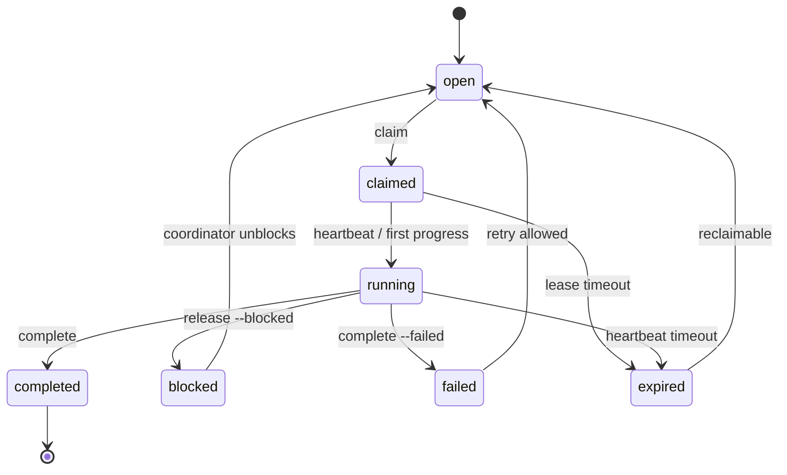

# Agent 自主领取任务池实施方案

## 背景

当前 AgentDesk 已经具备两条任务协作能力：

- `create_agentdesk_task` 会把用户目标转成 `.agent-desk/tasks/<taskId>/task.md`。
- `start_subagent_session` 会读取 task checklist，并由协调者一次性创建一组 subagent 去执行。
- `claim_next_task_item` / `complete_task_items` 已经能在 `<project>/task/*.task.md` 上做原子领取和完成。

下一步要从“协调者主动派单给 agent”转成“协调者产出可执行 task，agent 自主领取、执行、回报”。这更接近公司运营里的任务池和责任制：管理层定义目标、边界、验收和优先级；团队或个人按能力从队列中认领；系统负责透明状态、节奏、例外升级和审计。

## 目标

AgentDesk 应新增一个任务池工作流：

1. 用户或主 agent 只负责生成标准化 task，并把 task 放入可领取队列。
2. agent 以稳定身份和能力标签进入队列，自主获取下一项合适工作。
3. 领取动作必须原子化，写入租约、负责人、session id、过期时间和可读状态。
4. agent 只实现自己领取的 work item，验证后提交完成报告。
5. 系统能回收超时、失败、阻塞的 claim，并留下可审计记录。
6. 现有 CLI/MCP-only 定位不变，不引入 GUI、Electron、Web app、`prd.json`、Gemini CLI 或 Claude Code 兼容层。

## 运营管理原则映射

| 公司运营原则 | AgentDesk 对应机制 |
| --- | --- |
| 目标清晰 | task 必须包含目标、范围、验收标准和不做事项 |
| 职责明确 | claim 绑定 `agentId`、`sessionId`、work item 和租约 |
| 授权而非微管 | 协调者发布任务，agent 根据能力自主领取 |
| 岗位匹配 | work item 标注能力、风险、路径范围和依赖 |
| WIP 控制 | 每个 agent 有最大并行 claim 数，每个 task 有并发上限 |
| 节奏管理 | heartbeat 续租，超时自动释放或升级 |
| 例外升级 | blocked、failed、expired 进入人工或主 agent 协调队列 |
| 数据复盘 | 记录 lead time、cycle time、attempts、失败原因和验证结果 |
| 审计透明 | markdown 保持可读，结构化状态保存在 `.agent-desk` |

## 目标体验

### 任务生产者

任务生产者不再决定“谁去做”，只决定“什么值得做”：

```sh
verunectl tasks create \
  --project /path/to/project \
  --title "实现自主领取任务池" \
  --brief "生成可由 agent 自主领取的任务池，实现 claim/heartbeat/release/complete 闭环"
```

生成成功后，task 进入 `ready` 或 `queued` 状态。主 agent 可以查看队列，但不需要逐个启动子代理。

### 自主 agent

agent 启动后先注册身份和能力，然后领取下一项可做工作：

```sh
verunectl queue next \
  --project /path/to/project \
  --agent agent-docs-01 \
  --session codex-session-abc \
  --capability docs \
  --capability mcp
```

系统返回一个 claim：

- `claimId`
- `taskId`
- `workId`
- work item 标题、详情、验收标准
- 推荐执行模式
- 允许修改的路径范围
- heartbeat/complete/release 指令

agent 完成后：

```sh
verunectl queue complete <claimId> \
  --project /path/to/project \
  --report /path/to/report.json
```

## 核心设计

### 1. Task 仍然是经营目标的载体

`.agent-desk/tasks/<taskId>/task.md` 继续保留人类可读的任务说明和 checklist。它应该逐步标准化为以下结构：

```md
# 实现自主领取任务池

## Goal

让 agent 能从任务池自主领取 work item，完成后回报结果。

## Operating Context

- Priority: P1
- Required capabilities: mcp, cli, orchestration
- Risk level: medium
- Max parallel claims: 6
- Integration branch: master

## Acceptance Criteria

- MCP 和 CLI 都支持查看、领取、续租、释放、完成 work item。
- 同一个 work item 不会被两个 agent 同时领取。
- 过期 claim 可被回收并重新领取。
- session/task 文档能展示领取、执行、完成和失败状态。

## Tasks

- [ ] 设计并实现 queue 状态模型
- [ ] 增加 MCP queue 工具
- [ ] 增加 verunectl queue 命令
- [ ] 补充自主领取 skill
- [ ] 增加并发、过期、释放、完成测试
```

markdown 用来读和审计，结构化队列状态不依赖人工解析全部正文。

### 2. 新增结构化队列状态

建议新增这些状态文件：

```text
<project>/.agent-desk/
  tasks/
    <taskId>/
      task.md
      meta.json
      queue.json
  claims/
    <claimId>.json
  agents/
    <agentId>.json
  locks/
    queue.lock
```

`queue.json` 保存 task 内 work item 的状态：

```json
{
  "schemaVersion": 1,
  "taskId": "task-...",
  "queueStatus": "open",
  "priority": "P1",
  "maxParallelClaims": 6,
  "workItems": [
    {
      "workId": "task-...:item-01",
      "index": 1,
      "title": "设计并实现 queue 状态模型",
      "status": "open",
      "requiredCapabilities": ["mcp", "cli"],
      "allowedPaths": ["src/lib/", "test/"],
      "dependsOn": [],
      "claimId": "",
      "attempts": 0,
      "lastError": ""
    }
  ]
}
```

`claims/<claimId>.json` 保存领取租约：

```json
{
  "schemaVersion": 1,
  "claimId": "claim-...",
  "taskId": "task-...",
  "workId": "task-...:item-01",
  "agentId": "agent-mcp-01",
  "sessionId": "codex-session-abc",
  "status": "claimed",
  "claimedAt": "2026-05-23T15:00:00.000Z",
  "leaseExpiresAt": "2026-05-23T15:30:00.000Z",
  "heartbeatAt": "2026-05-23T15:12:00.000Z",
  "completedAt": null,
  "reportPath": "",
  "lastError": ""
}
```

### 3. Work item 状态机



队列选择时只返回 `open` 且依赖已满足的 work item。`expired`、`failed`、`blocked` 默认不自动重试，除非 task policy 允许或主 agent 明确释放。

### 4. MCP 工具

建议新增一组 control-plane queue MCP tools：

- `list_agentdesk_work`：列出可领取、已领取、阻塞、失败和完成的 work items。
- `claim_next_agentdesk_work`：按 agent 能力、优先级、依赖、WIP 限制原子领取下一项。
- `heartbeat_agentdesk_claim`：续租并记录 agent 仍在工作。
- `release_agentdesk_claim`：释放或标记 blocked/failed，附带原因。
- `complete_agentdesk_work`：完成 claim，写入报告、验证、变更文件和风险。
- `read_agentdesk_claim`：查看单个 claim 的上下文与审计记录。

这些工具应该和现有 `claim_next_task_item` 分层：

- `claim_next_task_item` 继续服务简单 markdown task 文件。
- `claim_next_agentdesk_work` 服务 `.agent-desk/tasks/<taskId>` control-plane 队列，是下一步主线。

### 5. CLI 命令

`verunectl` 增加 `queue` 子命令：

```text
verunectl queue list [--task <taskId>] [--status open|claimed|running|blocked|failed|completed] [--json]
verunectl queue next --agent <agentId> --session <sessionId> [--capability <name>]... [--json]
verunectl queue heartbeat <claimId> [--json]
verunectl queue release <claimId> --reason <text> [--status blocked|failed|open] [--json]
verunectl queue complete <claimId> --report <file> [--json]
verunectl queue claim <workId> --agent <agentId> --session <sessionId> [--json]
```

`queue next` 是 agent 自主领取的主要入口。`queue claim` 用于人工指定某项 work item，但仍然走原子 claim。

### 6. Agent 匹配策略

第一版不需要复杂调度器，采用确定性排序即可：

1. 过滤不可领取项：已完成、已领取且租约未过期、依赖未完成、超过 task 并发上限、超过 agent WIP 上限。
2. 匹配能力：work item 的 `requiredCapabilities` 必须被 agent capabilities 覆盖；未声明能力的任务可被任何 agent 领取。
3. 排序优先级：`priority`、blocked 恢复时间、创建时间、attempts。
4. 同分时按 `taskId` 和 `workId` 稳定排序，保证可复现。

这符合公司运营里的“公开队列、岗位匹配、先高优再先到”的原则，避免一开始就引入黑盒调度。

### 7. 执行隔离

自主领取后，最容易出问题的是多个 agent 在同一个 checkout 改同一批文件。建议规则：

- 默认把 claim 视为一个最小责任单元，而不是整个 task。
- 若 claim 允许写代码且存在并发风险，推荐使用 worktree claim runner。
- 如果使用当前 checkout，claim 必须带 `allowedPaths`，并在 prompt 中强调只改这些路径。
- 文档、只读调研、测试补强等低冲突任务可以使用当前 checkout。
- 完成报告必须包含 `changedFiles`、`testsRun`、`risks`。

长期看，可以把 `start_subagent_session` 重构为一种“批量启动 agent worker”的能力：它不再预分配 checklist item，而是启动 N 个 worker；每个 worker 进入后调用 `claim_next_agentdesk_work` 拉取任务。

## 实施路线

### Phase 1：任务池状态模型

- 新建 `src/lib/work-queue.mjs`。
- 从 `task.md` checklist 初始化 `queue.json`。
- 支持 work item 状态、claim 文件、租约时间、heartbeat、release、complete。
- 所有写入通过 `locks/queue.lock` 或 task 粒度 lock 原子化。
- 为 `open -> claimed -> completed`、重复领取、租约过期补测试。

### Phase 2：MCP/CLI 暴露

- MCP 增加 `list_agentdesk_work`、`claim_next_agentdesk_work`、`heartbeat_agentdesk_claim`、`release_agentdesk_claim`、`complete_agentdesk_work`。
- `verunectl` 增加 `queue` 子命令。
- `read_agentdesk_task` 返回 queue 摘要，包括 open/claimed/running/blocked/failed/completed 计数。
- 文档补充自主领取工作流。

### Phase 3：Agent worker skill

- 新增 `skills/claim-agentdesk-work/SKILL.md`。
- skill 规则：先 claim，后实现；同一轮只处理一个 claim；验证后 complete；阻塞则 release。
- prompt 中注入 claim 上下文、allowedPaths、验收标准和完成报告 schema。

### Phase 4：把 session 从派单改成 worker 池

- 新增 session 模式：`worker-pool`。
- `sessions start` 在该模式下只启动最多 N 个 worker，不预先把 checklist item 分给 agent。
- 每个 worker 自己调用 queue 工具领取任务。
- session 统计从 agent 固定列表改成 claim 事件流聚合。
- 保留当前 `start_subagent_session` 行为作为兼容路径，直到 worker-pool 稳定。

### Phase 5：运营指标和治理

- 生成 task/session 级指标：队列深度、WIP、lead time、cycle time、过期次数、失败次数、一次通过率。
- 增加异常列表：超时、反复失败、长时间 blocked、无 agent 能力匹配。
- 支持 task policy：最大尝试次数、默认租约时长、是否允许自动重试。

## 验收标准

- 能创建一个 AgentDesk task，并初始化为可领取队列。
- 两个 agent 同时请求下一项时，只会有一个 claim 成功领取同一 work item。
- claim 租约过期后，该 work item 可重新进入 open 队列。
- agent heartbeat 能续租并更新审计时间。
- agent complete 后，task markdown 和结构化状态都能反映完成结果。
- blocked/failed/release 路径有明确原因和可查记录。
- CLI 与 MCP 行为一致，并有覆盖并发、过期、重复领取、完成权限校验的测试。

## 风险与取舍

- 不建议第一版直接做智能调度。确定性队列更容易测试和审计。
- 不建议只靠 markdown claim marker 存状态。markdown 适合人读，租约、过期、重试、指标需要结构化文件。
- 不建议立刻删除现有 session fanout。它仍适合明确拆分、一次性并发执行的任务；worker-pool 应作为新模式逐步替换。
- 不建议默认所有自主 agent 共用当前 checkout。自主领取天然会增加并发不确定性，代码修改类任务应优先 worktree。

## 下一步可执行 task 草案

```md
# AgentDesk 自主领取任务池第一阶段实现

## Goal

把 AgentDesk 从“协调者主动把 checklist item 分配给 subagent”推进到“task 入池后由 agent 自主领取 work item”的第一阶段。第一阶段聚焦结构化 queue 状态、原子 claim、heartbeat、release、complete 以及 CLI/MCP 基础入口，不改变现有 session fanout 默认行为。

## Constraints

- 保持 CLI/MCP-only，不增加 GUI、Electron、Web app 或 npm run dev 验证。
- 不引入 `prd.json`、Gemini CLI 或 Claude Code 兼容层。
- 默认模型/执行说明仍显式保持 `gpt-5.5`、`xhigh`、`fast`、并发上限 6、集成到 `master`。
- 不破坏现有 `claim_next_task_item`、`complete_task_items` 和 `start_subagent_session` 行为。

## Acceptance Criteria

- `.agent-desk/tasks/<taskId>/queue.json` 能从 `task.md` checklist 初始化。
- `claim_next_agentdesk_work` 能按优先级和能力原子领取 open work item。
- 同一个 work item 不能被两个未过期 claim 同时占用。
- `heartbeat_agentdesk_claim` 能续租。
- `release_agentdesk_claim` 能释放或标记 blocked/failed。
- `complete_agentdesk_work` 能完成 claim，并记录报告摘要、验证和风险。
- `verunectl queue` 提供 list/next/heartbeat/release/complete。
- 测试覆盖并发领取、过期回收、权限校验、完成状态同步。

## Tasks

- [ ] 新建 `src/lib/work-queue.mjs`，实现 queue 初始化、读取、排序、claim、heartbeat、release、complete。
- [ ] 为 queue 状态文件和 claim 文件定义 schema 与原子写入锁策略。
- [ ] 在 MCP server 中新增 queue tools，并返回结构化 claim 上下文。
- [ ] 在 `verunectl` 中新增 `queue` 子命令。
- [ ] 在 `read_agentdesk_task` / `tasks show` 中展示 queue 摘要。
- [ ] 新增 `skills/claim-agentdesk-work/SKILL.md`，规定 agent 自主领取和完成流程。
- [ ] 补充测试覆盖并发领取、重复领取、租约过期、release、complete 和权限校验。
- [ ] 更新 README 和中文文档，说明新旧两种执行模式的边界。
```
