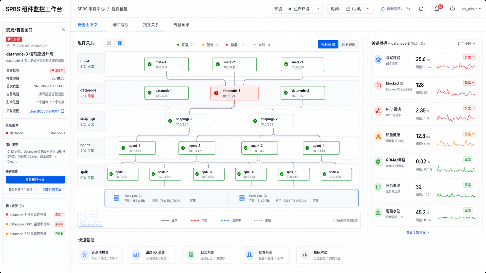

# SPBS 组件监控工作台方案

## 背景与只读边界

本方案汇总 AgentDesk task `task-20260515T070056Z-spbs` 与 Codex App subagents 的只读调研结果，目标是在 SPBS 变更或告警发生后，按集群内组件快速查看关键监控指标，判断问题是否与变更 / 告警相关，并明确前端适合承载的位置。

只读输入：

- 文档目录：`/Users/yanzzp/CodeProjects/process/spbs-sre-skills/docs`
- 前端目录：`/Users/yanzzp/CodeProjects/process/space-sre-ussadmin`

本轮只在当前 AgentDesk 项目输出方案，不修改上述两个外部目录。若后续进入前端实现，需要另起实现任务。

前端概念图由 `imagegen` 生成，用作信息架构参考，不代表现有实现：



## 组件关系总览

SPBS 运行态定位应先区分“告警上报组件”和“最可能根因组件”。许多告警的 reporter 只是症状出口，例如 `spdk io hang` 可能来自下游 `datanode`、网络、本地 NVMf 或 QoS；`agent` 侧 CSI 错误可能来自 `meta` 或本机 `spdk`；`snapmgr` 只有进入 `snap_mgr` netapi / manager / task 后，才应把根因优先落到 `snapmgr`。

| 组件 | 覆盖 role / 对象 | 职责边界 | 日志入口 | 快速判断 | 常见关联组件 |
|---|---|---|---|---|---|
| `meta` | `metacluster`、`compass`、`gateway`、`datapipe`、`etcd` | 控制面、leader / 切主、pool 选择、disk fault / heartbeat 聚合、任务 / 视图 / 容量状态 | `/usr/local/services/metacluster/logs/metacluster`、`/usr/local/services/compass/logs/compass`、`/usr/local/services/datapipe/logs`；gateway 路径待确认 | 看 role 存活、leader change、`SelectPoolReqCmd`、`TransferChunk`、diskset/chunk/task/QoS reject | `datanode`、`snapmgr`、`agent`、`spdk/client` |
| `datanode` | `datanode`、`diskset`、`chunk`、`metalog`、物理盘 | 数据面块读写、盘状态、metalog、heartbeat、SPDK/NVMe 初始化、shared RDMA/RPC allocator | `/usr/local/spbs/logs/data_<listen_start_port>.log`；metrics `52xx` 通常反推日志 `50xx` | 看 `up{role="datanode"}`、`changes(up[2h])`、disk/diskset health、`disk_io_*`、`aio_check_*`、`store_read_*`、内存 / loop latency | `meta`、`spdk/client`、宿主机 NVMe/PCIe/driver、systemd/watchdog、shared allocator |
| `snapmgr` | `snapmgr`、`snapshot`、`restore`、`branch` | 快照、恢复、分支和任务调度 | `/usr/local/services/snapmgr/logs/snap_mgr` | 看 `spbs_snapmgr_snap_mgr_task*`、版本、RPC serve latency、任务 `chunk_num/cur_index` 是否推进 | `meta/metacluster`、`meta/datapipe`、`datanode`、`spdk/client`、SPOS 远端对象读 |
| `agent` | `cli`、`agent`、`mount`、`attach`、CSI / CLI 请求入口 | 用户侧 / CSI 入口、attach/mount、调用 meta / spdk / sdk | `/usr/local/services/spbs_agent/logs/cli` | 看 `cli:5301 /metrics`、`spbs_spdk_up`、`spbs_cli_bdev_*`、`spbs_sdk_*`、`spbs_cli_ext4_*`、RPC call/serve | `meta/compass`、`meta/metacluster`、`spdk/client`、`snapmgr` |
| `spdk` | `spdk`、`spdk_node`、VDA、bdev、IO hang | 客户端数据面、bdev、IO worker、reattach、view sync、RDMA / 本地 NVMe 连带症状 | `/usr/local/services/spbs_spdk/logs/spdk.log`；升级旧进程看 `/var/spbs/temp/<lastversion>/logs/spdk.log` | 看 `spdk:5349`、`spdk_node:9100`、`net_io_error_count`、`spbs_connection_count`、`spbs_net_flink_count`、目标卷 blocked/QoS | `agent`、`datanode`、`meta`、宿主机 NIC/bond/RDMA、本地 NVMe/NVMf、QoS/volume retry queue |

## 共享指标 Family 目录

共享 Prometheus 模型不是后台 push。`/metrics` 请求进入 `BeginRequest()` 后同步执行 `Update()`，再执行已注册 callback。`monitor_reset_gap_sec` 默认 7 天，会重建部分易膨胀 family，并累加 `spbs_metrics_reset_count`，所以指标突降不等于业务恢复。

client / SPDK 收集链：

1. VDA callback 打 `monitor start/end`。
2. 调用 `bdev_spbs_get_all_monitor()`。
3. 切到 `g_spbs.start_thread`，先收 `meta_syncer`、`client`、`volume_reattacher`。
4. 通过 `spdk_for_each_channel()` 遍历各 `io_worker`。
5. 合并 `msg_latency_us`、`msg_size_bytes`、`volume_blocked_io_count`、`volume_qos_pend_io_count`、`volume_qos_pend_io_cost_us`。

| 分组 | Family | 语义与注意点 |
|---|---|---|
| message | `msg_latency_us`、`msg_size_bytes` | 基础 labels 包括 `container/module/type/cmd/retcode`，可选 `volume_id/branch_id/cluster_uuid`；client serve 侧才额外有 `source`，send 侧默认不带内部 source |
| volume | `volume_blocked_io_count`、`volume_qos_pend_io_count`、`volume_qos_pend_io_cost_us` | `volume_blocked_io_count` 是 counter，但更像“当前 blocked IO 数”的持续累加，可用 `increase(...[5m])` 看 blocked 强度；`volume_qos_pend_*` 是 Gauge `Set()` 的累计字段，建议用 `delta(...[5m])` |
| rpc / net | `spbs_rpc_meta_statis`、`spbs_connection_count`、`net_io_*`、`net_mem_use_bytes`、`net_ctrl_num`、`spbs_net_flink_count` | `net_io_*` 是应用会话 send/recv 症状；`spbs_net_flink_count` 只证明接口 UP/DOWN，不能覆盖交换机丢包、RDMA 拥塞或重传 |
| runtime | `spbs_process_resident_memory_bytes`、`loop_latency_us`、`aio_check_latency_us` | `spbs_process_resident_memory_bytes` 是 RSS 高水位，不是瞬时内存；`loop_latency_us` 受开关控制；`aio_check_latency_us` 是 aio container 维度 |
| datanode 联动 | `disk_io_*`、`store_read_cnt`、`store_read_bytes`、`task_cnt`、`task_block_cnt` | 用来判断 blocked/QoS 是否由下游磁盘、store 或任务堵塞放大 |

blocked / QoS 根因判断建议顺序：

1. 先看 `disk_io_latency_us`、`disk_io_size_total_bytes`、`store_read_cnt`、`store_read_bytes` 是否异常。
2. 再看 `delta(volume_qos_pend_io_count[5m])` 和 `delta(volume_qos_pend_io_cost_us[5m])`。
3. 最后看 `increase(volume_blocked_io_count[5m])` 与 `msg_latency_us`。

`volume_blocked_io_count` 是滞后信号，`msg_latency_us` 是消息层症状，二者都不应单独定根因。

## 组件维度指标矩阵

| 组件 | 可观测对象 | 核心指标 | 适用变更 / 告警场景 | 快速判断入口 | 可能关联组件 |
|---|---|---|---|---|---|
| `meta` | `metacluster`、`compass`、`gateway`、`datapipe`、`etcd` | `spbs_rpc_call_total`、`spbs_rpc_serve_total`、`spbs_rpc_*_duration_seconds`、leader 指标、diskset/chunk 状态、`task_cnt`、`task_block_cnt` | 切主、SelectPool、TransferChunk、QosReject、容量 / 修复 / 视图同步 | Event Detail 组件监控 + meta 控制面 dashboard；按 role / leader / task drilldown | `datanode`、`agent`、`snapmgr`、`spdk/client` |
| `datanode` | datanode 实例、diskset、chunk、metalog、物理盘 | `up{role="datanode"}`、`changes(up[2h])`、`disk_io_latency_us`、`disk_io_error_count`、`disk_io_size_total_bytes`、`aio_check_latency_us`、`store_read_cnt`、`store_read_bytes`、`net_mem_use_bytes`、`loop_latency_us` | 慢盘、坏盘、IO hang、RDMA/RPC allocator、recover 慢 | cluster 健康 TopN -> instance/disk drilldown -> `data_50xx.log` / dmesg | `meta`、`spdk/client`、`shared` |
| `snapmgr` | snapshot、restore、branch、snap_mgr、datapipe、SPOS remote read | `spbs_snapmgr_snap_mgr_task*`、`spbs_rpc_serve_duration_seconds`、`store_read_cnt`、`store_read_bytes`、client 侧 `msg_latency_us`、`volume_blocked_io_count`、`volume_qos_pend_io_count` | snapshot / restore 卡住、remote snapshot / SPOS 慢读、跨集群 clone / expand 异常 | task progress panel + RPC latency/error + client volume symptom | `meta/metacluster`、`meta/datapipe`、`spdk/client`、`agent` |
| `agent` | cli、agent、CSI、mount、attach、bdev、sdk、ext4 | `up{role="cli"}`、`spbs_rpc_call_total`、`spbs_rpc_serve_total`、`spbs_spdk_up`、`spbs_cli_bdev_*`、`spbs_sdk_*`、`spbs_cli_ext4_*`，联动 `msg_latency_us`、`volume_*` | attach/mount 失败、CSI 创建/扩容错误码、`5301` metrics endpoint 异常、local cli-agent down | Event Detail reporter / retcode / source 聚合 + `localhost:5301/metrics` 人工验证提示 | `meta/compass`、`meta/metacluster`、`spdk/client` |
| `spdk` | SPDK/VDA/bdev/io_worker/meta_syncer/volume_reattacher、`5349`、`9100` | `up{role="spdk"}`、`up{role="spdk_node"}`、`spbs_spdk_up`、`msg_latency_us`、`msg_size_bytes`、`volume_blocked_io_count`、`volume_qos_pend_io_count`、`volume_qos_pend_io_cost_us`、`net_io_error_count`、`spbs_connection_count`、`spbs_net_flink_count` | read/write hang、reattach、sync view timeout、`5349` scrape flap、host RDMA/NVMf local path | affected instance / volume quick query；必看 `increase(volume_blocked_io_count[5m])` 与 `delta(volume_qos_pend_io_count[5m])` | `agent/cli`、`datanode`、`meta`、host network |
| `shared/client` | shared Prometheus runtime、message/disk/net/task/store/volume families | `msg_latency_us`、`msg_size_bytes`、`disk_io_*`、`volume_*`、`spbs_rpc_meta_statis`、`spbs_connection_count`、`net_io_*`、`net_mem_use_bytes`、`net_ctrl_num`、`task_cnt`、`task_block_cnt`、`store_read_*`、`spbs_process_resident_memory_bytes`、`aio_check_latency_us`、`loop_latency_us` | 跨组件公共症状、采集 reset、metrics 空白、TopN 聚合、client IO hang | 公共 dashboard 或嵌入面板变量 `cluster/time_window/component/role/instance/volume/disk` | 所有组件 |

## 变更 / 告警快速验证流程

### 输入

固定输入：

- `cluster`
- `event_id` 或 change id
- event/change 时间窗
- `component` / `role`
- affected `instance`
- affected `volume`
- affected `disk`

时间窗建议：

- 主窗口：`event.startAt - 10m` 到 `lastSeenAt/recoveredAt + 10m`
- 对照窗口：当前 `5m` 与 `15m`

### Step 1: Cluster 级健康门禁

先用统一门禁判断是采集问题、控制面异常，还是真实运行态异常。

```promql
up{cluster="$cluster", role=~"spdk|cli|datanode|metacluster|compass|datapipe|snapmgr|etcd"}
changes(up{cluster="$cluster"}[2h])
increase(spbs_metrics_reset_count{cluster="$cluster"}[2h])
```

同时看 leader 是否稳定、disk/diskset/容量/任务是否异常。输出四类状态：

- `正常`
- `疑似采集问题`
- `运行态异常`
- `控制面异常`

### Step 2: 组件 TopN

按 reporter 和根因候选拆开：

- `spdk/client`：`volume_blocked_io_count`、`delta(volume_qos_pend_io_count[5m])`、`net_io_error_count`、`spbs_net_flink_count`、RPC 非 OK。
- `datanode`：`DataNodeReadReqCmd` / `DataNodeWriteReqCmd` P99、`disk_io_latency_us`、`disk_io_error_count`、`spbs_rpc_meta_statis`、`net_mem_use_bytes`。
- `meta`：leader、`spbs_rpc_serve_total` / duration、`task_cnt`、`task_block_cnt`、diskset 状态。
- `snapmgr`：task status、`cur_index/chunk_num`、RPC serve。
- `agent`：`cli:5301`、CSI / attach / mount 错误、`spbs_spdk_up`。

常用模板：

```promql
topk(10, sum by(instance)(increase(net_io_error_count{cluster="$cluster"}[5m])))

increase(volume_blocked_io_count{cluster="$cluster", volume_UUID="$volume"}[5m])

delta(volume_qos_pend_io_count{cluster="$cluster", volume_UUID="$volume"}[5m])

topk(10,
  histogram_quantile(0.99,
    sum by(instance, disk_uuid, le)(
      rate(disk_io_latency_us_bucket{cluster="$cluster"}[5m])
    )
  )
)
```

### Step 3: 实例 / Volume / Disk 钻取

实例钻取要显示端口映射和日志入口：

- `spdk:5349` -> `/usr/local/services/spbs_spdk/logs/spdk.log`
- `cli:5301` -> `/usr/local/services/spbs_agent/logs/cli`
- `datanode 52xx metrics` -> `/usr/local/spbs/logs/data_50xx.log`

Volume 钻取：

1. 先看 blocked / QoS / message latency。
2. 再映射 `volume -> chunk -> diskset master -> datanode/disk`。
3. 若 disk/store 正常但 QoS 升高，再判断 client QoS。

Disk 钻取：

1. 先对齐 `disk_uuid` / `disk_id` / host。
2. 再看 `disk_io_*`、`aio_check_latency_us`、`dmesg`、RAID / SMART 证据。
3. 如果监控仍挂 fault 但本地盘恢复，继续转查 `meta/metacluster` auto-revive / manual revive 清 fault 路径。

### Step 4: 回到事件详情形成证据链

建议 evidence card 字段：

| 字段 | 说明 |
|---|---|
| `scope` | cluster / component / instance / volume / disk |
| `time_window` | 查询窗口 |
| `dashboard_key` | `client_unique_key` |
| `variables` | embed runtime variables |
| `query` | PromQL 或 dashboard panel id |
| `finding` | 观察结论 |
| `confidence` | 高 / 中 / 低 |
| `next_action` | 下一步动作 |
| `owner` | 处理人或组件 owner |
| `external_link` | 监控外链兜底 |

待确认接口：Event Detail 当前更偏只读 raw analysis 和 status history。若要真实回写 evidence，需要确认复用 `/ops-event/annotate-ops-event`，还是新增 `/event/annotate-event` 一类接口。

## 前端落点分析

### 首选：SPBS Event Detail 组件监控

优先在 `src/pages/sre/ussadmin/event-center/detail/[id]/index.tsx` 增加“组件监控”区块。首版建议用 Card，放在 Basic / Lifecycle 后、Associated alerts 前；Drawer 适合从 role / cluster / alert 行继续钻取实例、volume、disk；Tab 需要重构当前非 Tab 页面，优先级较低。

原因：

- Event Detail 已经有 Basic information、Lifecycle、Associated alerts、Event Analysis(raw)。
- 最适合形成“事件上下文 -> 组件指标 -> 证据链”的闭环。
- 可以从 event 和 alerts 推导变量：`event_id`、时间窗、`cluster`、`serviceRole`、`ipList`、labels。

实现风险：

- 当前 SPBS Event Detail 把 `affectedClusters` 写为空数组。实现时应解析 `eventItem.clusters`，或从 `alerts[].cluster` 聚合兜底，否则监控嵌入缺少核心变量。
- 多 cluster 事件不要静默取第一个，应显式提供 cluster selector。

### 第二落点：Storage Cluster Detail `Monitor` Tab

在 `src/pages/sre/ussadmin/spbs-meta/storage-cluster/detail/[id]/$storage-detail-tabs/config.tsx` 的 tab 数组新增：

```ts
{ tab: 'Monitor', key: 'monitor' }
```

并新增同级 `monitor/index.tsx` 承载日常巡检看板。

适用场景：

- 日常巡检。
- 变更后验证。
- cluster 级组件健康总览。

变量优先从 storage cluster detail 的 `metaData.clusterName`、`region`、`env`、`azInfo`、`idc` 推导。该页是 cluster 维度，不应把 `event_id` / `alert_id` 作为必填。

### 仅作参考：V2 Cluster Detail Preview

V2 Cluster Detail 已有 hover preview + open 的交互体验，可以作为交互参考。但现有实现包含硬编码 Grafana URL 和静态预览图，不应复制到 SPBS 新方案。

需要避免的模式：

- Product FE 维护 `MASTER_DASHBOARD_URL` / `EN_DASHBOARD_URL` / `PN_DASHBOARD_URL` / `BG_DASHBOARD_URL`。
- 业务页面拼接 `grafana_base_url` 或 dashboard id。
- SPBS storage detail 中节点监控外链直接拼接 Grafana URL。

## `MonitorDashboardEmbed` 接入约定

统一接入链路：

1. Monitoring BE 注册 dashboard，保存 `client_unique_key`、Grafana base、dashboard id 等平台元数据。
2. Monitoring BE 运行时生成 `embed_url`。
3. Monitoring FE 提供 `MonitorDashboardEmbed` / Guard，负责请求 embed URL、iframe 渲染、loading/error/empty/no-permission。
4. Product FE 只传 `client_unique_key` 与 runtime variables。

命名规则：

```text
${bu}_${product}_${scene}_${component}
```

建议 key：

- `shopee_ussadmin_spbs_event_detail_component_monitor`
- `shopee_ussadmin_spbs_storage_cluster_monitor_overview`
- `shopee_ussadmin_spbs_storage_cluster_monitor_meta`
- `shopee_ussadmin_spbs_storage_cluster_monitor_datanode`
- `shopee_ussadmin_spbs_storage_cluster_monitor_snapmgr`
- `shopee_ussadmin_spbs_storage_cluster_monitor_agent`
- `shopee_ussadmin_spbs_storage_cluster_monitor_spdk`
- `shopee_ussadmin_spbs_storage_cluster_monitor_shared_client`

历史文档里出现过 `client_unqiue_key` 拼写错误。方案中建议兼容历史字段，但新 Product FE 和新文档统一使用 `client_unique_key`。

运行时变量：

| 变量层 | 变量 |
|---|---|
| 基础 | `region`、`env`、`cluster`、`component`、`role`、`from`、`to` |
| 事件上下文 | `event_id`、`severity`、`status`、`rule_id`、`alert_id` |
| 钻取 | `instance` / `ip`、`volume`、`disk`、`diskset`、`pool`、`client` |

状态设计：

- `loading`：使用现有 Card / Skeleton / Spin 风格。
- `empty`：展示 dashboard 未配置，并提示检查 `client_unique_key`。
- `error`：展示重试按钮和错误摘要。
- `no-permission`：展示无权限说明，并保留申请或外链入口。
- `iframe blocked` / Grafana 登录失败：保留 `Open in Grafana` 外链兜底。

外链也应由 Monitoring FE / BE 返回或由 Guard 包装，Product FE 不直接拼 Grafana URL。

## 前端概念图与页面映射

概念图是产品信息架构参考，不是现有页面截图。

映射关系：

- 左侧事件 / 变更上下文：对应 Event Detail 的 Basic information、Lifecycle、Associated alerts。
- 中心组件拓扑：对应固定组件目录 `meta`、`datanode`、`snapmgr`、`agent`、`spdk`，底部 pool / disk / volume 卡片对应 Storage Cluster Detail 的 Pool / Disk / Volume 钻取。
- 右侧指标面板：由选中的 component / instance 驱动，展示读写延迟、blocked IO、QoS、RPC 错误、磁盘健康、RDMA / 网络、任务、容量水位。
- 顶部 tabs `告警上下文 / 组件指标 / 拓扑关系 / 处置记录`：Event Detail 首版可先用“组件监控”Card 承载，后续再演进为 Tab 或 Drawer。
- 处置记录 / evidence card：回写到事件详情，作为判断变更 / 告警是否导致问题的证据链。

## 后续实现边界

本方案不直接修改前端代码。后续实现时建议另起任务，并拆分为：

1. Event Detail 事件上下文变量补齐：解析 `eventItem.clusters`，从 alerts 聚合 cluster / role / ip / labels。
2. 接入 `MonitorDashboardEmbed` 的 Event Detail 组件监控 Card。
3. Storage Cluster Detail 新增 `Monitor` Tab 与 cluster 级变量选择器。
4. 注册 SPBS 相关 `client_unique_key` 与 dashboard 元数据。
5. 迁移已有硬编码 Grafana URL 到统一 embed 模式。
6. 补充 loading / error / no-permission / empty / external-link fallback 状态。
7. 再决定是否新增 evidence 回写接口。
